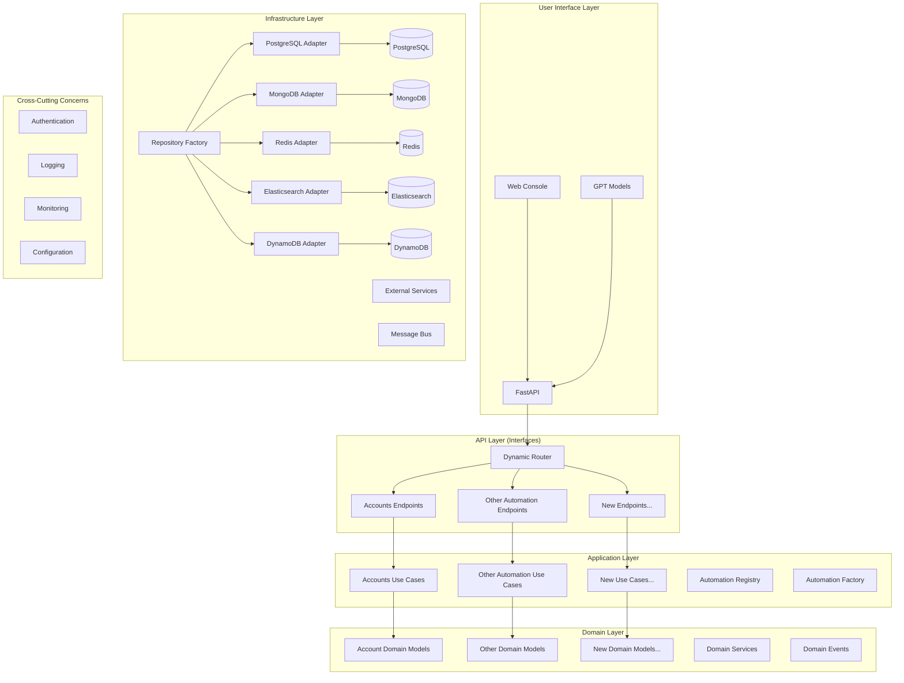
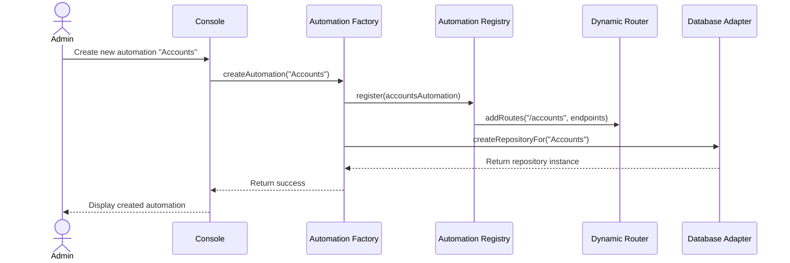
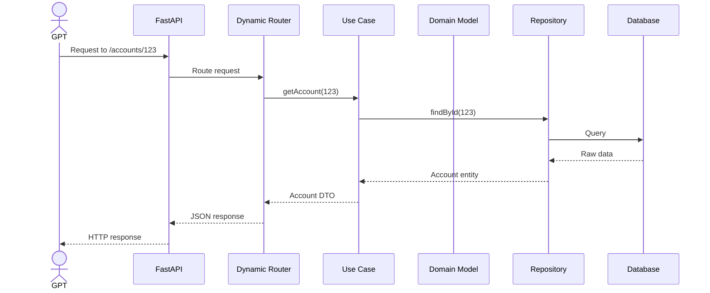
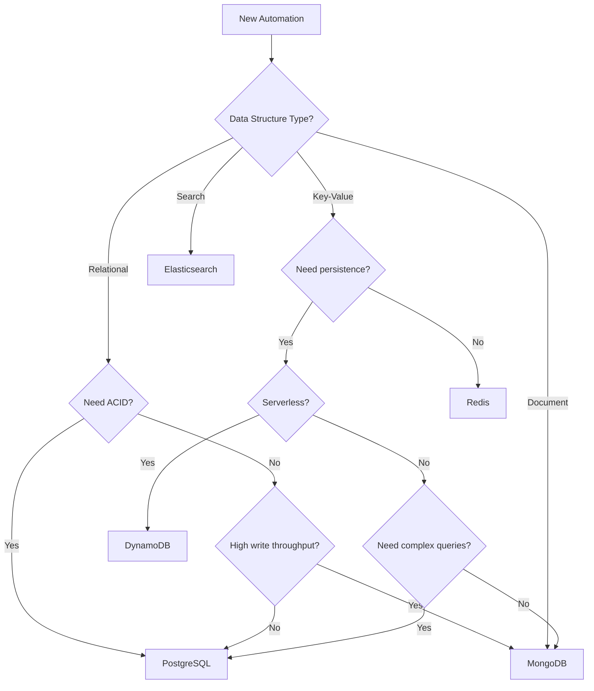
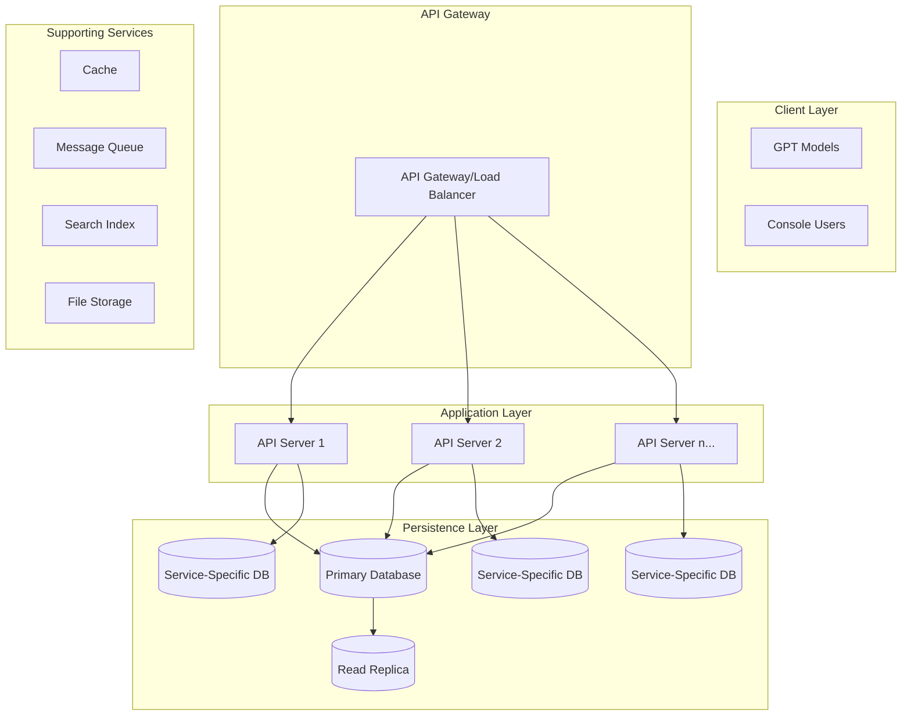
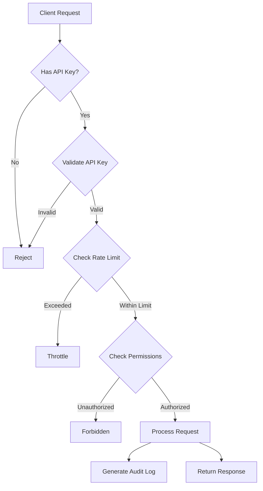

# theCouncil Infrastructure Map

## Domain-Driven Design Architecture

## System Components

### Console Automation Creation Flow

### Request Processing Flow

## Database Selection Decision Tree

## Deployment Architecture

## Security Architecture

